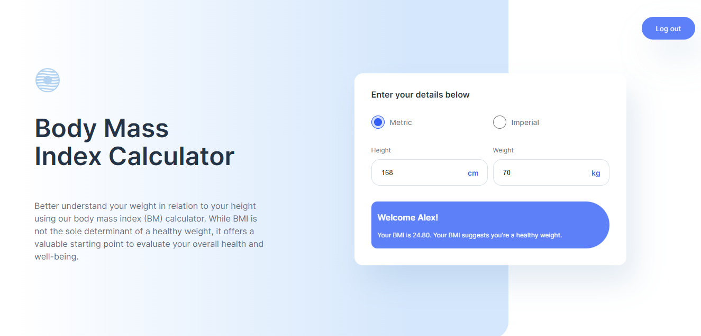

# BIM Calculator App

## Video demo

https://www.youtube.com/watch?v=ArNzlLLgvrY

## Description

The BIM Calculator App is a simple and user-friendly tool that allows users to calculate their Body Mass Index (BMI). BMI is a measure of body fat based on height and weight. It can be used to assess whether an individual's weight is within a healthy range.

This app provides an easy way to calculate your BMI, understand the results, and receive basic recommendations based on the calculated BMI value.

## Project Structure

- **static**: This directory contains static assets used in the app.
  - **fonts**: Store font files for styling the app.
  - **images**: Store images and icons used in the app.
  - **js**: JavaScript files for any client-side functionality.
  - **styles.css**: The main CSS file for styling the app.

- **templates**: Contains HTML templates used to render different pages of the app.
  - **apology.html**: An apology page for handling errors and exceptions.
  - **index.html**: The main page where BMI calculation is performed.
  - **layout.html**: The base template for other HTML pages.
  - **login.html**: A login page for user accounts.
  - **register.html**: A registration page for new users.

- **app.py**: The main Python script that controls the app's behavior.
- **bmicalculator.db**: An SQLite database primarily used for the storage of user data.
- **helpers.py**: A Python module containing helper functions or utilities used in the app.

## Features

- Calculate BMI quickly and accurately.
- Get instant feedback on your BMI category (underweight, normal weight, overweight, or obese).
- Receive basic health recommendations for a healthy lifestyle.
- User-friendly interface for a seamless user experience.

## Usage

1. Open the app on your device.
2. Choose the units system of your preference.
3. Enter your weight and height.
4. Click the "Calculate" button.
5. Your BMI and corresponding category will be displayed.
6. Read the health recommendations and BMI limitations for more information.

## Inspiration
The design for the BIM Calculator App UI draws its inspiration from the [Frontend Mentor Body Mass Index Calculator Challenge](https://www.frontendmentor.io/challenges/body-mass-index-calculator-brrBkfSz1T), chosen to simulate a real-life scenario and enhance the user experience.  

## Contact

If you have any questions or feedback, feel free to contact me at [alejsdev@email.com].
